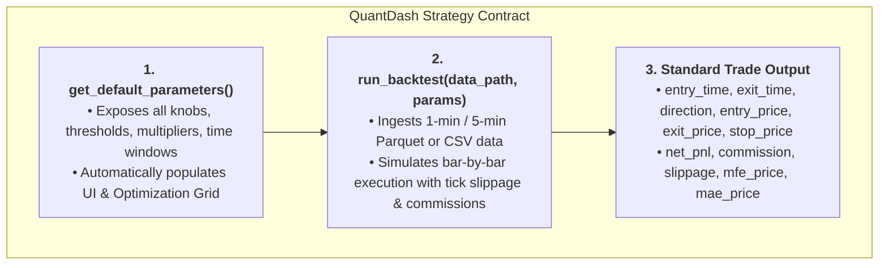
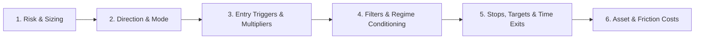

# QuantDash Strategy Architecture & Universal Parameter Specification

This document is the master specification for building **any quantitative trading strategy** compatible with **QuantDash**. It provides complete design templates, parameter schemas, and data contracts across all major strategy types:
1. **Intraday Breakout Strategies** (Open Range Breakout, Volatility Breakout, Donchian Channels)
2. **Mean Reversion Strategies** (Implied Volatility Overshoot, Buy-the-Dip, RSI/Bollinger)
3. **Trend Following & Multi-Day Swing Strategies** (Moving Average Crossover, Momentum Rotation)
4. **Order Flow & Volume Imbalance Strategies** (Whale Prints, Delta Absorption, Volume Profile)

---

## 1. How QuantDash Interacts with Strategies

QuantDash dynamically loads any `.py` strategy file at runtime. The UI automatically reads the parameter dictionary and:
1. Generates interactive inputs in the sidebar for every parameter.
2. Automatically registers all numeric parameters into the **Parameter Optimization Engine** (Start, End, Step grid sweep).
3. Executes `run_backtest(data_path, params)` and feeds trade outputs into the **Performance Dashboard, Equity Curves, Drawdown Analytics, Monthly Heatmaps, and Monte Carlo Simulator**.



---

## 2. Universal Parameter Control Architecture

To ensure granular control, all strategy scripts should organize their parameters into 6 standardized modular blocks:



### 1. Risk & Sizing Controls
* **`RISK_TYPE ($ or %)`**: `"$"` for fixed dollar risk per trade, `"%" ` for percentage of account equity.
* **`RISK_VALUE`**: e.g., `1000.0` (Dollars) or `1.0` (1% equity risk).
* **`RISK_FREE_RATE_PCT`**: e.g., `4.0` (Annualized % for Sharpe/Sortino calculation).

### 2. Directional Controls
* **`DIRECTION`**: `"Both"`, `"Long-Only"`, or `"Short-Only"`. Allows isolating and analyzing long and short sleeves independently.

### 3. Entry Triggers & Multipliers
* **`MULTIPLIER_K`**: Trigger distance multiplier ($0.2\text{--}1.5$).
* **`LOOKBACK_PERIOD`**: Period for ATR, Moving Average, Donchian, or Volatility ($5, 14, 20, 50$).
* **`ENTRY_BAR_CONFIRMATION`**: `1` (Immediate touch) vs `0` (Wait for bar close).

### 4. Regime & Noise Filters
* **`USE_VOL_FILTER (1 or 0)`**: `1` to enable volatility expansion filter, `0` for raw execution.
* **`VOL_FILTER_LOOKBACK`**: Fast/Slow lookback (e.g. $\text{ATR}_5 > \text{SMA}_{20}(\text{ATR}_5)$).
* **`USE_REGIME_FILTER (1 or 0)`**: `1` to enable VIX Contango/Backwardation gating.
* **`TREND_SMA_FILTER`**: e.g., `200` (Only take Longs above 200 SMA, Shorts below).

### 5. Exit & Stop-Loss Architecture
* **`STOP_LOSS_MODE`**: `"Open"`, `"ATR"`, `"Fixed_Pts"`, or `"Trailing"`.
* **`STOP_LOSS_MULT`**: Distance multiplier for ATR or fixed point stop.
* **`PROFIT_TARGET_MULT`**: `0.0` (Disabled / Run to session close) or $1.5\text{--}3.0\times$ risk.
* **`MAX_TRADES_PER_DAY`**: `1` (Single-shot) or `2` (Allow reversal flip).
* **`ENTRY_CUTOFF_TIME`**: e.g., `"15:00:00"` (Do not enter new positions during last hour).
* **`EOD_EXIT_TIME`**: e.g., `"15:59:00"` (Mandatory flat time stop).

### 6. Asset & Friction Parameters
* **`TICK_SIZE`**: `0.25` for ES/NQ, `0.10` for Gold, `0.01` for Stocks/ETFs.
* **`MINI_POINT_VALUE`**: `$50.0` (ES), `$20.0` (NQ), `$100.0` (Gold).
* **`MICRO_POINT_VALUE`**: `$5.0` (MES), `$2.0` (MNQ), `$10.0` (MGC).
* **`COMMISSION_MINI_RT`**: `$5.76` (Standard round-trip commission).
* **`COMMISSION_MICRO_RT`**: `$1.82` (Micro round-trip commission).
* **`SLIPPAGE_TICKS`**: `1` (Conservative 1-tick slippage per order execution).

---

## 3. Parameter Schemas by Strategy Archetype

### Archetype A: Intraday Volatility Breakout (TEST-01 & TEST-02)
```python
def get_default_parameters():
    return {
        "RISK_TYPE ($ or %)": "$",
        "RISK_VALUE": 1000.0,
        "RISK_FREE_RATE_PCT": 4.0,
        "DIRECTION (Both, Long-Only, Short-Only)": "Both",
        "MULTIPLIER_K": 0.4,
        "ATR_LOOKBACK": 14,
        "USE_ATR_TREND_FILTER (1 or 0)": 1,
        "FAST_ATR_PERIOD": 5,
        "SLOW_ATR_SMA_PERIOD": 20,
        "MAX_TRADES_PER_DAY": 1,
        "STOP_LOSS_MODE (Open, ATR, Pts)": "Open",
        "STOP_ATR_MULT": 1.0,
        "PROFIT_TARGET_MULT (0=None)": 0.0,
        "ENTRY_CUTOFF_TIME": "15:00:00",
        "EOD_EXIT_TIME": "15:59:00",
        "TICK_SIZE": 0.25,
        "MINI_POINT_VALUE": 50.0,
        "MICRO_POINT_VALUE": 5.0,
        "COMMISSION_MINI_RT": 5.76,
        "COMMISSION_MICRO_RT": 1.82,
        "SLIPPAGE_TICKS": 1
    }
```

---

### Archetype B: Implied Volatility (IV) Overshoot Mean Reversion
```python
def get_default_parameters():
    return {
        "RISK_TYPE ($ or %)": "$",
        "RISK_VALUE": 1000.0,
        "RISK_FREE_RATE_PCT": 4.0,
        "DIRECTION (Long-Only, Both)": "Long-Only",
        "IV_OVERSHOOT_MULT": 1.0,          # Daily drop must exceed 1.0 * Daily IV
        "TREND_SMA_PERIOD": 200,            # Must be above 200 SMA
        "MIN_DAILY_IV_PCT": 0.55,           # Minimum volatility threshold
        "ENTRY_ORDER_TYPE (Limit, Market)": "Limit",
        "LIMIT_OFFSET_ATR": 0.1,            # Place limit order 0.1 ATR below previous close
        "MAX_HOLD_DAYS": 7,                 # Time stop (exit after N trading days)
        "PROFIT_TARGET_IV_MULT": 1.5,       # Exit at +1.5 * Daily IV rebound
        "HARD_STOP_LOSS_PCT": 10.0,         # Emergency stop loss (10%)
        "TICK_SIZE": 0.01,
        "POINT_VALUE": 1.0,
        "COMMISSION_PER_SHARE": 0.005,
        "SLIPPAGE_CENTS": 0.02
    }
```

---

### Archetype C: Multi-Day Trend Following / Donchian Swing
```python
def get_default_parameters():
    return {
        "RISK_TYPE ($ or %)": "%",
        "RISK_VALUE": 2.0,                  # Risk 2% of equity per trade
        "RISK_FREE_RATE_PCT": 4.0,
        "DIRECTION (Both, Long-Only, Short-Only)": "Both",
        "DONCHIAN_ENTRY_PERIOD": 20,        # Enter on 20-day high/low breakout
        "DONCHIAN_EXIT_PERIOD": 10,         # Exit on 10-day opposite channel
        "ATR_POSITION_SIZING_PERIOD": 20,   # Position size based on 20-day ATR
        "MAX_PORTFOLIO_HEAT_PCT": 10.0,     # Max total open risk across all positions
        "TRAILING_STOP_ATR_MULT": 3.0,      # Trail stop by 3 * ATR
        "TICK_SIZE": 0.25,
        "MINI_POINT_VALUE": 50.0,
        "MICRO_POINT_VALUE": 5.0,
        "COMMISSION_MINI_RT": 5.76,
        "COMMISSION_MICRO_RT": 1.82,
        "SLIPPAGE_TICKS": 1
    }
```

---

## 4. Mandatory Trade Output Dictionary Schema

Regardless of strategy type, `run_backtest(data_path, params)` **must return a dictionary containing `"trades"`**:

```python
{
    "trades": [
        {
            "entry_time": "2024-03-15 09:42:00",   # Timestamp (ET wall-clock or UTC)
            "exit_time": "2024-03-15 15:59:00",    # Timestamp
            "direction": "long",                   # Lowercase 'long' or 'short'
            "entry_price": 5142.25,                # Float fill price
            "exit_price": 5168.50,                 # Float fill price
            "stop_price": 5120.00,                 # Initial stop loss price
            "net_pnl": 1280.50,                    # Net dollar PnL (gross - comms - slippage)
            "commission": 11.52,                   # Round-trip commissions paid
            "slippage": 25.00,                     # Dollar slippage incurred
            "mfe_price": 5174.00,                  # Maximum Favorable Excursion
            "mae_price": 5138.50                   # Maximum Adverse Excursion
        }
    ],
    "metrics": {                                   # Optional custom metrics dict
        "total_trades": 1,
        "final_equity": 101280.50
    }
}
```

---

## 5. Performance Optimization Best Practices

1. **Pre-Calculate Daily Aggregates**:
   * Pre-compute Daily ATR, moving averages, and highs/lows vectorized using `df.groupby("date")` before the intraday execution loop.
2. **Use Fast NumPy Arrays in Intraday Loops**:
   * Inside the intraday loop, extract numpy arrays (`bars["high"].values`, `bars["low"].values`) instead of using slow `pandas.iterrows()`.
3. **Support Multi-File Input**:
   * Allow `data_path` to accept a single string, list of strings (multi-year files), or pre-loaded `DataFrame`.
