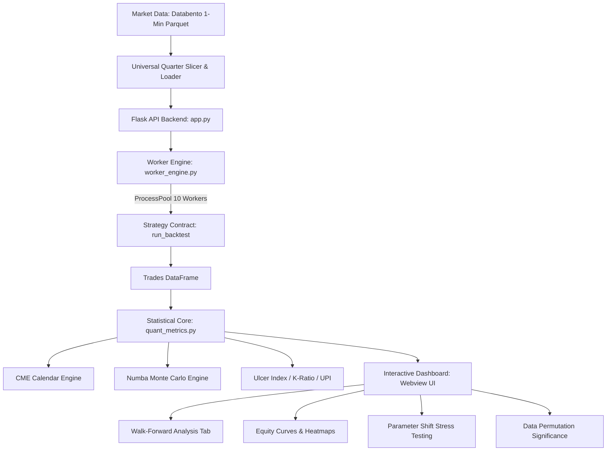

# QuantDash: Institutional Quantitative Research & Backtesting Platform

[](https://python.org)
[](https://palletsprojects.com/p/flask/)
[](https://numba.pydata.org/)
[](https://opensource.org/licenses/MIT)

**QuantDash** is a high-performance quantitative backtesting and research platform designed for systematic trading strategies on CME Equity Futures (ES, NQ, MES, MNQ) using 1-minute intraday tick data.

Built with an **isolated 10-core parallel multiprocessing engine**, QuantDash executes massive parameter sweeps, Walk-Forward Optimizations (WFO), and Monte Carlo simulations with zero Global Interpreter Lock (GIL) contention.

---

## 🏛️ System Architecture



---

## ⚡ Key Platform Capabilities

### 1. Multi-Core Parallel Processing (`worker_engine.py`)
- Distributes grid searches, Walk-Forward training cycles, and parameter shifts across **10 parallel CPU processes**.
- Isolated worker module avoids UI/Flask re-import overhead on process spawn.
- Delivers an **8x–10x speedup** on parameter sweeps and multi-year WFO runs.

### 2. Walk-Forward Optimization (WFO) Engine
- **Rolling & Anchored Horizons**: Flexible In-Sample (IS) training and Out-of-Sample (OOS) testing windows configured in quarters.
- **Continuous OOS Equity Curve**: Real-time stitching of out-of-sample trades across consecutive cycles.
- **Walk-Forward Efficiency (WFE)**: Multi-metric evaluation (CAGR WFE and Sharpe WFE) to detect curve-fitting and overfitting.
- **Parameter Stability Tracking**: Measures parameter migration across consecutive cycles.

### 3. Institutional Statistical Core (`quant_metrics.py`)
- **CME Equity Calendar (`pandas_market_calendars`)**: Calculates Sharpe, Sortino, and daily trade frequency strictly against valid CME futures trading days (excluding holidays and halts).
- **Smoothness & Risk Ratios**:
  - **K-Ratio**: Linear regression slope divided by slope standard error.
  - **Ulcer Index & UPI (Martin Ratio)**: Quadratic drawdown severity metrics.
  - **Calmar Ratio & RoMD**: Return over Maximum Drawdown.
- **Monte Carlo Engine (Numba Accelerated)**: Parallel bootstrapping and permutation testing for path dispersion, ruin probability, and drawdown distributions.

---

## 📐 Strategy Implementation Contract

Any trading strategy plugged into QuantDash must implement the standard contract defined in [`Strategy_Files/template_strategy.py`](Strategy_Files/template_strategy.py):

```python
def run_backtest(data: Union[str, pd.DataFrame], params: dict = None) -> dict:
    """
    Executes strategy backtest.
    
    Parameters:
    - data: File path (str) or pre-sliced pandas DataFrame.
    - params: Dictionary of optimizable strategy inputs.
    
    Returns:
    - dict with keys 'trades', 'metrics', 'params'
    """
    # 1. Indicator Calculation (Must be lagged with .shift(1))
    # 2. Tick Rounding (round_to_tick)
    # 3. Bar-by-bar Simulation with same-bar stop validation
    # 4. Return trades list and quant_metrics.calculate_stats()
```

### Mandatory Execution Rules
1. **No Lookahead Bias**: Indicator signals must use `.shift(1)` before entry decision logic.
2. **Tick Rounding**: All price fills and stop levels must be rounded to valid tick sizes (`0.25` for ES/NQ).
3. **Same-Bar Stop Loss Validation**: If price penetrates stop loss during the entry bar, the trade is stopped out immediately.
4. **Execution Costs**: Slippage ticks applied on both entry and exit (`2 * SLIPPAGE_TICKS * Tick_Size * Point_Value`), plus round-turn commissions.

---

## 🚀 Quickstart & Installation

### 1. Clone the Repository
```bash
git clone https://github.com/Naman23u/QuantDashForLLM.git
cd QuantDashForLLM
```

### 2. Install Dependencies
```bash
pip install -r requirements.txt
```

### 3. Launch the Dashboard
```bash
# Webview Desktop Application
python desktop_app.py

# Or run Flask Server in Browser
python app.py
```
Open your browser at `http://127.0.0.1:5050` if running via `app.py`.

---

## 🤖 Instructions for AI / LLMs
If you are an LLM reading this repository:
1. Inspect [`llms.txt`](llms.txt) for high-density contract specifications.
2. Follow [`QUANTDASH_STRATEGY_RULES.md`](QUANTDASH_STRATEGY_RULES.md) for strict intraday trading session constraints and indicator lagging.
3. Use [`Strategy_Files/template_strategy.py`](Strategy_Files/template_strategy.py) as your base template when generating new trading strategies.

---

## 📄 License
Distributed under the MIT License. See [`LICENSE`](LICENSE) for details.
